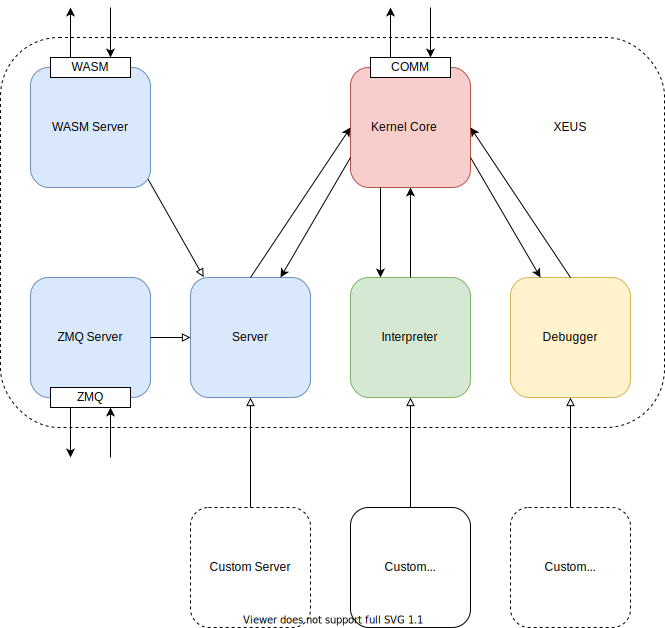

.. Copyright (c) 2016, Johan Mabille, Sylvain Corlay and Martin Renou

   Distributed under the terms of the BSD 3-Clause License.

   The full license is in the file LICENSE, distributed with this software.

Internals of xeus
=================

`xeus` is internally architected around four main components:

- The *server* is the middleware component responsible for receiving and sending messages to
  the Jupyter client and for handling the concurrency model of the application. `xeus` provides
  two implementations of the *server* component, one built upon `ZeroMQ` and one built for in-memory
  communication in the browser.
- The kernel core routes the messages to the appropriate method of the *interpreter* and does some book-keeping
  operations such as storing the message and its answer in the history manager, or sending relevant messages to the server.
- The *interpreter* provides the interface that kernel authors must implement.
- The *debugger* provides the interface for implementing a debugger if the kernel supports debugging.

The *interpreter*, the *server* and the *debugger* are well isolated from each other, only the kernel core can
interact with them. The kernel core is also loosely coupled with the server, which makes it
easy to replace the server implementation provided by `xeus` with a custom one.

`xeus` uses the ZeroMQ_ library which provides the low-level transport layer over which the messages
are sent. Before reading more, it is best to familiarize yourself with the concepts of ZeroMQ_.

.. _ZeroMQ: https://zeromq.org/
