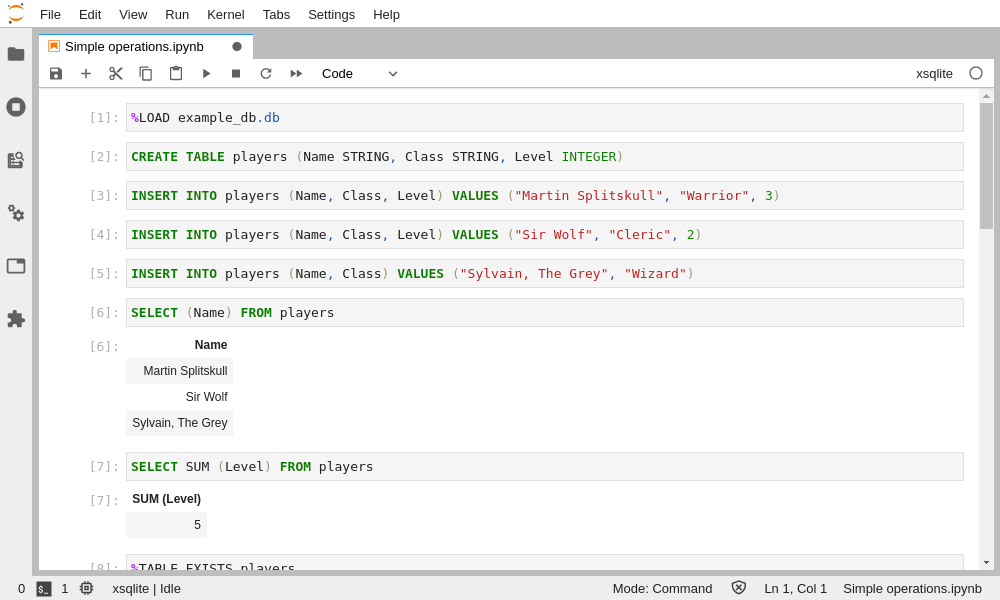
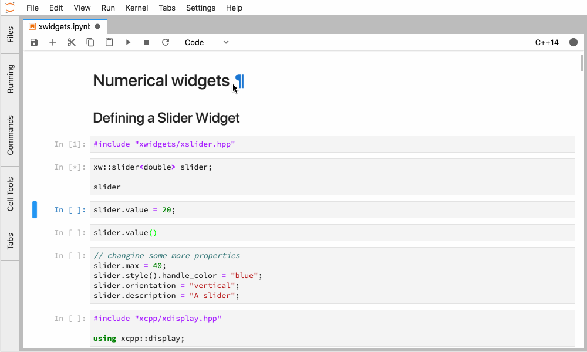
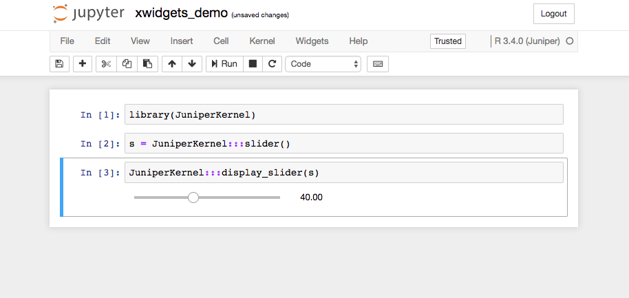

.. Copyright (c) 2017, Johan Mabille, Loic Gouarin and Sylvain Corlay

   Distributed under the terms of the BSD 3-Clause License.

   The full license is in the file LICENSE, distributed with this software.

Related projects
================

xeus-cling
----------

.. image:: xeus-cling.svg
   :alt: xeus-cling

The `xeus-cling`_ project is a Jupyter kernel for the C++ programming language
based on the Cling C++ interpreter from CERN and Xeus, the native
implementation of the Jupyter protocol.

.. image:: xeus-cling-screenshot.png
   :alt: C++ notebook

xeus-python
-----------

The `xeus-python`_ project is a Jupyter kernel for the Python programming
language based on the Xeus implementation of the protocol.

.. image:: xeus-python-screencast.gif
   :alt: xeus-python screencast

xeus-sqlite
-----------

The `xeus-sqlite`_ project is a Jupyter kernel for the SQLite.

xwidgets
---------

The xwidgets_ project is a C++ implementation of the Jupyter interactive
widgets protocol. The Python reference implementation is available in the
ipywidgets ipywidgets_ project.

xwidgets enables the use of the Jupyter interactive widgets in the C++
notebook, powered by the xeus-cling kernel and the cling C++ interpreter from
CERN. xwidgets can also be used to create applications making use of the
Jupyter interactive widgets without the C++ kernel per se.

JuniperKernel
-------------

The JuniperKernel_ project is a Jupyter kernel for the R programming language
built with Xeus and Rcpp_.

.. _xeus-cling: https://github.com/jupyter-xeus/xeus-cling
.. _xeus-python: https://github.com/jupyter-xeus/xeus-python
.. _xeus-sqlite: https://github.com/jupyter-xeus/xeus-sqlite
.. _xwidgets: https://github.com/QuantStack/xwidgets
.. _JuniperKernel: https://github.com/JuniperKernel/JuniperKernel
.. _Rcpp: https://github.com/RcppCore/Rcpp
.. _ipywidgets: https://github.com/jupyter-widgets/ipywidgets
