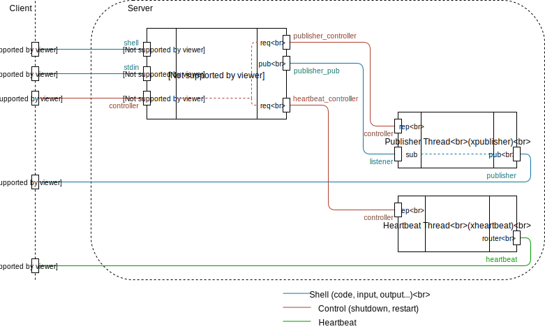

.. Copyright (c) 2016, Johan Mabille, Sylvain Corlay and Martin Renou

   Distributed under the terms of the BSD 3-Clause License.

   The full license is in the file LICENSE, distributed with this software.

Server
======

Public API
----------

The server part of `xeus` provides a public API made in ``xserver.hpp``. This file contains the base
class ``xserver``, which must be inherited from any class implementing a server. This is the unique
entry point into the server component used by the kernel core.

`xeus-zmq` provides the following implementations:

- ``xserver_zmq.hpp``: This file contains the interface of the default server implementation, that can
  be used directly or extended in order to override parts of its behavior.
- ``xserver_control_main.hpp``: This file contains the interface of a server that handles the shell and
  the control socket on different threads. The main thread listens to the control socket.
- ``xserver_shell_main.hpp``: This file contains the interface of a server that handlels the shell
  and the control sockets on different threads. The main threads listens to the shell socket.

Before we dive into the details of the server implementation, let's have a look at the public interface:

.. literalinclude:: ../../include/xeus/xserver.hpp
   :language: cpp
   :dedent: 4
   :lines: 21-73

First thing to notice is the ``xserver`` class makes use of the Non-Virtual Interface pattern. This
allows a clear separation between the client interface (the public methods) and the interface for
subclasses (protected non-virtual methods and private virtual methods).

The client interface can be divided into three parts:

- the API to control the server: this is how you configure, start and stop the server. The related methods
  are ``update_config``, ``start``, ``stop`` and ``abort_queue``. These methods forward to private pure
  virtual methods that must be implemented in inheriting classes.
- the API to send message: this is where you decide on which channel you send the message. The related
  methods are ``send_shell``, ``send_control``, ``send_stdin`` and ``publish``. These methods also forward
  to virtual methods that must be implemented in inheriting classes.
- the API to register callbacks: the methods ``register_shell_listener``, ``register_control_listener``
  and ``register_stdin_listener`` allow clients (such as the kernel core component) to register functions
  that will be called when a message is received by the server. This way, the server component is loosely
  coupled with its clients, it doesn't need to know anything about them.

The subclass interface contains private virtual methods that must be implemented in inheriting classes to
define the behavior of the server, and protected methods to notify the client that a message has been
received. This makes inheriting classes independent from the way the ``xserver`` class stores and uses
the callbacks.

xserver_zmq
-----------

The ``xserver_zmq`` class is the default implementation of the server API, its internals are illustrated
in the following diagram:

The default server is made of three threads communicating through internal `ZeroMQ` sockets. The main
thread is responsible for polling both ``shell`` and ``controller`` channels. When a message is received
on one of these channels, the corresponding callback is invoked. Any code executed in the interpreter
will be executed by the main thread. If the ``publish`` method is called, the main thread sends a message
to the publisher thread.

Having a dedicated thread for publishing messages makes this operation a non-blocking one. When the kernel
main thread needs to publish a message, it simply sends it to the publisher thread through an internal socket
and continues its execution. The publisher thread will poll its internal socket and forward the messages to
the ``publisher`` channel.

The last thread is the heartbeat. It is responsible for notifying the client that the kernel is still alive.
This is done by sending messages on the ``heartbeat`` channel at a regular rate.

The main thread is also connected to the publisher and the heartbeat threads through internal ``controller``
channels. These are used to send ``stop`` messages to the subthread and allow to stop the kernel in a clean
way.

xserver_control_main
--------------------

The ``xserver_control_main`` class is an alternative implementation of the server API, its internals are
illustrated in the following diagram:

.. image:: server_control.svg
   :alt: server_control

This server runs four threads that communicate through internal `ZeroMQ` sockets. The main thread is
responsible for polling the ``control`` channel while a dedicated thread listens on the ``shell``
channel. Having separated threads for the ``control`` and ``shell`` channel makes it possible to send
messages on a channel while the kernel is already processing a message on the other channel. For instance
one can send on the ``control`` a request to interrupt a computation running on the ``shell``.

The control thread is also connected to the shell, the publisher and the heartbeat threads through internal
``controller`` channels. These are used to send ``stop`` messages to the subthread and allow to stop the
kernel in a clean way, similarly to the ``xserver_zmq``.

The rest of the implementation is similar to that of ``xserver_zmq``.

xserver_shell_main
------------------

The ``xserver_shell_main`` class is very similar to the ``xserver_control_main`` class, except that
the main thread listens on the ``shell`` channel as illustrated in the following diagram:

.. image:: server_main.svg
   :alt: server_main

