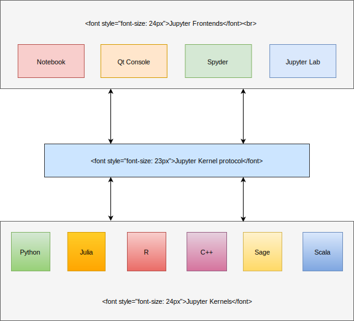

.. Copyright (c) 2016, Johan Mabille, Sylvain Corlay and Martin Renou

   Distributed under the terms of the BSD 3-Clause License.

   The full license is in the file LICENSE, distributed with this software.

Usage
=====

``xeus`` enables custom kernel authors to implement Jupyter kernels more easily. It takes the burden of implementing the Jupyter Kernel protocol so developers can focus on implementing the interpreter part of the Kernel.

.. raw:: html

    

.. note::
    In the following documentation:

      - ``interpreter`` refers to the part of the kernel responsible for executing the code, completing the code etc.
      - ``client`` refers to the Jupyter client, which can be Jupyter Notebook/JupyterLab/Jupyter console etc.
      - ``user`` refers to people using the kernel on any Jupyter client.

The easiest way to get started with a new kernel is to create a class inheriting from the base interpreter class ``xeus::xinterpreter`` and implement the private virtual methods

- ``execute_request_impl``: See execute_request_
  Code execution request from the client.
- ``complete_request_impl``: See complete_request_
  Code completion request from the client.
- ``inspect_request_impl``: See inspect_request_
  Code inspection request (using a question mark on a type for example).
- ``is_complete_request_impl``: See is_complete_request_
  Called before code execution (terminal mode) in order to check if the code is complete
  and can be executed as it is (e.g. when typing a `for` loop on multiple lines in Python, code will be considered
  complete when the `for` loop has been closed).
- ``kernel_info_request_impl``: See kernel_info_request_
  Information request about the kernel: language name (for code highlighting),
  language version, terminal banner etc.
- ``shutdown_request_impl``:
  Shutdown request from the client, this allows you to do some extra work before the kernel
  is shut down (e.g. free allocated memory).

A dummy kernel is provided as an example_ and a more advanced example kernel can be found here_.
You can also find real kernel implementations based on xeus:
  - `xeus-cling <https://github.com/jupyter-xeus/xeus-cling>`_: C++ kernel
  - `xeus-python <https://github.com/jupyter-xeus/xeus-python>`_: Python kernel

.. _example: https://github.com/jupyter-xeus/xeus-zmq/tree/master/example
.. _here: https://github.com/jupyter-xeus/xeus-calc/
.. _execute_request: https://jupyter-client.readthedocs.io/en/stable/messaging.html#execute
.. _complete_request: https://jupyter-client.readthedocs.io/en/stable/messaging.html#completion
.. _inspect_request: https://jupyter-client.readthedocs.io/en/stable/messaging.html#introspection
.. _is_complete_request: https://jupyter-client.readthedocs.io/en/stable/messaging.html#code-completeness
.. _kernel_info_request: https://jupyter-client.readthedocs.io/en/stable/messaging.html#kernel-info
